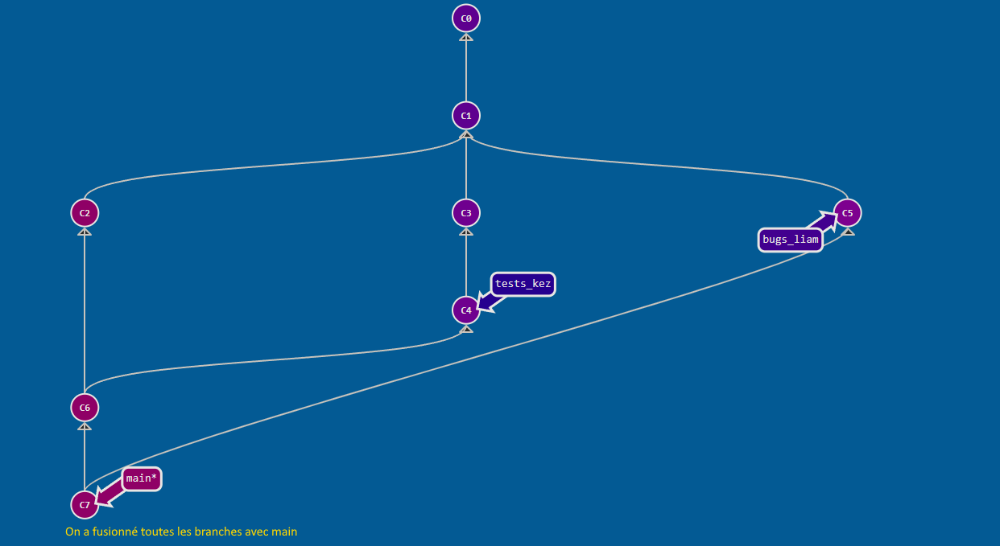

# Utilisation de Git

## C'est koi Git ? Et GitHub ???

```
"The difference between git and github is the same as the one between porn and pornhub"
- some random person on reddit
```

Git est un logiciel permettant de faire ce que l'on appelle du **versionnage**. C'est à dire qu'il permet, sans se prendre la tête avec pllusieurs copies de la même chose, d'en stocker plusieurs versions.

Github est un site web qui permet d'utiliser Git pour stocker des données en ligne, gratuitement et en illimité. Il contient le code de la plupart des logiciels "open source" qui existent (open source : code accessible et modifiable par tous).

> TLDR : **Git** est un logiciel, et **Github** un site qui permet de l'utiliser en ligne. 

## Concepts clés 

### Repository (ou Repo)
Un **repo** est comme un **dossier** et contient l'entièreté d'un projet.

### Commit
Un **commit** est l'état d'un repo à un moment donné. Un nouveau commit est créé à chaque modification du projet. 
Git garde en mémoire tous les commits du repo, ce qui permet de revenir en arrière à tout moment.

### Branche
Une branche correspond à un "chemin" dans lequel le projet se dirige. Dans chaque repo, une branche **main** ou **master** est la branche principale, les autres étant créées pour effectuer des modifications, puis soit supprimées soit *fusionnées* avec la branche principale (c'est pas aussi simple mais on a pas le temps).

Exemple : 


### Merge
Il est possible de fusionner 2 branches (souvent *main* et une autre) pour intégrer les changements faits dans une branche à une autre. Git est généralement capable de merge automatiquement sans créer de bugs, mais parfois il faut y aller à la main.

Exemple : on souhaite ajouter les contenus de la branche *tests* dans *main*.


## Notion de repo distant

Il existe 2 types de repos :
- un repo **local** est stocké *sur votre ordinateur*
- un repo **distant** est stocké ailleurs, par exemple *sur github*

### Interagir avec un repo distant

Il existe plusieurs manières d'intéragir avec un repo distant

1. Clone
> Cloner un repo distant revient à en créer une copie en local
2. Push
> La commande push permet de rajouter des modifications faites en local sur un repo distant
3. Pull
> La commande pull permet de récupérer les nouvelles informations dans le repo distant (mise à jour du repo local)

Pour simplifier les choses on va partir du principe suivant : 
- chaque branche est modifiée par une seule personne
- on évite de commit directement sur la branche main

Exemple : 2 branches ont été créées (tests et bugs) par 2 personnes différentes


On fusionne chacune de ces branches avec *main*.



**Aller dans exercices -> ex1-Github.md**