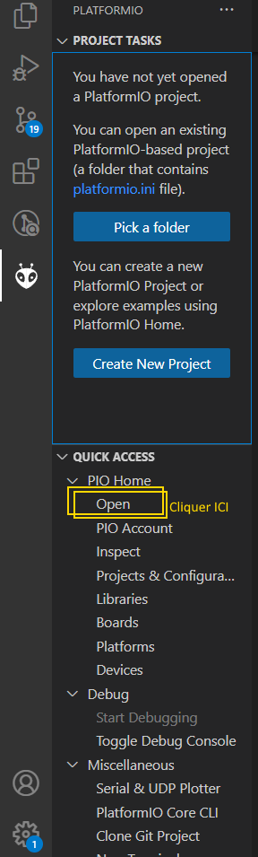

# Envoi de code sur une STM32 par platformIO

On va essayer d'envoyer du code sur une carte électronique. Pou cela il faut se munir :
- d'une carte **ST Nucleo L432KC** ou **ST Nucleo F446RE**(l'utilisation d'une autre carte est possible mais ajoute de la difficulté)
- d'un câble capable d'envoyer des données sur cette carte (USB - micro USB)

L'objectif de cet exercice n'est pas d'apprendre à programmer, mais à envoyer du code est le tester. Le code est donc très simple.

## Framework, fonctions

Nous allons demander à la carte de simplement envoyer du texte sur un terminal via un bus UART (celui relié à l'USB), en utilisant le framework Arduino.

Le framework Arduino est codé en C++ et utilise 2 fonctions : `setup()` et `loop()`.
Elles correspondent à :
```cpp
void main()
{
    setup();

    while(true)
    {
        loop();
    }
}
```

Pour utiliser l'UART, on va utiliser la classe Serial d'Arduino.
Elle est utilisée comme ceci :
```cpp
/* Includes */
#include <Arduino.h>

/* Pins réservés */
// PINS_UART : A0, A1, A2, A7 

/* Variables */
uint32_t compteur;

void setup()
{
    compteur = 0;
    Serial.begin(9600);
    /* Pour modidifer le baud rate, ajouter la ligne :
     * 'monitor_speed = xxxx'
     * dans platformio.ini et mettre le même nombre dans le Serial.begin
     * Par défaut 9600
     */
}

void loop()
{
    Serial.print("Quelque chose");
    compteur++;
    delay(1000); 
}
```

Pour récupérer ce programme et l'envoyer sur une carte :
- ouvrir le menu `Home` de PLatformIO 



- cliquer sur `Open project` et choisir le dossier `Code-formation`
- Brancher la carte
- Cliquer sur la flèche (->) en bas de l'interface VSCode 
- Pour observer les Serial.print, cliquer sur l'icône du Serial Monitor (ressemble à une prise électrique)


Si le texte s'affiche bien, bravo, vous savez envoyer du code avec PlatformIO !

A faire :
- Créer une fonction qui affiche quelque chose sur le terminal, l'utiliser dans loop()

**Aller dans documentation -> 5-Documentation.md**
